# 🎙️ Multilingual Note-Taking Agent (HOLON x KBI Hackathon Track 1)
[](https://python.org)
[](https://streamlit.io/)
[](https://fastapi.tiangolo.com/)
[](https://www.assemblyai.com/)
[](https://groq.com/)
[](https://www.langchain.com/)


This project is a submission for Track 1 of the **HOLON x KBI AI Agents Hackathon 2025**. It aims to build an AI agent that assists office workers by transcribing, summarizing, and enabling interaction with multilingual meeting recordings.

## Overview

Manually taking notes during fast-paced, multilingual meetings is challenging and inefficient. This agent tackles this problem by:

1.  Accepting recorded meeting audio files.
2.  Transcribing the speech accurately, detecting language and separating speakers.
3.  Generating concise meeting summaries.
4.  Extracting key action items discussed.
5.  Allowing users to ask questions about the meeting content via a chat interface.

## ✨ Features

*   **Audio Upload:** Supports various audio and video formats (MP3, WAV, M4A, MP4, MOV, etc.).
*   **Multilingual Transcription:** Uses AssemblyAI API for accurate transcription, language detection, and speaker diarization.
*   **Meeting Summarization:** Generates concise summaries using LangChain and the Groq API (running models like Llama 3).
*   **Keyword Search:** Easily search for specific words or phrases in the transcript. Matched terms are highlighted directly in the transcript viewer for quick navigation and context.
*   **Action Item Extraction:** Identifies and lists specific action items using a targeted LangChain and Groq API call.
*   **Interactive Chat:** Allows users to ask questions about the transcript content, receiving context-aware answers from the LLM via Groq.
*   **Web Interface:** Simple and intuitive UI built with Streamlit for easy interaction.

## 🎬 Demonstration Video

Watch a quick demonstration of the Multilingual Note-Taking Agent in action, showcasing the Streamlit interface:

📽️ [Watch the Demo Video](https://drive.google.com/file/d/1JIEy2PhjRmKbPdTmwWuXhiOcmfhleHq7/view?usp=sharing)

## 🏗️ Architecture

The application follows a simple client-server architecture:

1.  **Streamlit Frontend:** Provides the user interface for uploading files, triggering actions (transcribe, summarize/actions), displaying results, keyword searching and interacting with the chat.
2.  **FastAPI Backend:** Serves as the API layer. It receives requests from the frontend, handles file storage temporarily, interacts with external services (AssemblyAI, Groq via LangChain), processes the data, and returns results. Runs locally via `uvicorn`.
3.  **External Services:**
    *   **AssemblyAI:** Handles the core speech-to-text processing.
    *   **Groq:** Provides fast LLM inference for summarization, action item extraction, and chat responses via LangChain.

```mermaid
graph TD
    A([👤 User]) -- Interacts via Browser --> B[🖥️ Streamlit Frontend]
    B -- 🎧 /transcribe (Audio File) --> C{⚙️ FastAPI Backend}
    B -- 📝 /summarize (Transcript) --> C
    B -- 📋 /extract-action-items (Transcript) --> C
    B -- 💬 /chat (Transcript + Query) --> C
    C -- ⬆️ Upload Audio / Get Transcript --> D[🧠 AssemblyAI API]
    C -- 🔁 Summarize / Extract / Chat --> E[🤖 Groq API via LangChain]
    D -- 📄 Transcription Result --> C
    E -- 🧠 LLM Response --> C
    C -- 📦 API Response (JSON) --> B
    B -- 🔍 Search Keyword --> B
    B -- 📤 Export TXT --> A
    B -- 📊 Displays Results --> A
```




## 🛠️ Tech Stack

*   **Frontend:** Streamlit
*   **Backend:** FastAPI (Python 3.10+)
*   **ASR Service:** AssemblyAI API
*   **LLM Service:** Groq API (using models like `llama-3.3-70b-versatile` or similar)
*   **LLM Framework:** LangChain (v0.3)
*   **Language:** Python


## 🚀 Setup & Installation

Follow these steps to run the agent locally:

**1. Prerequisites:**

*   Python 3.10 or higher
*   `pip` package installer
*   Git
*   AssemblyAI API Key: Get one from [assemblyai.com](https://www.assemblyai.com/)
*   Groq API Key: Get one from [console.groq.com](https://console.groq.com/)

**2. Clone the Repository:**
```
git clone https://github.com/DakshRathi/Multilingual-Note-Taking-Agent.git
cd Multilingual-Note-Taking-Agent
```


**3. Install Dependencies:**

```
pip install -r requirements.txt
```


**4. Configure API Keys:**

Create a file named `.env` in the project's root directory (`Multilingual-Note-Taking-Agent/.env`). Add your API keys to this file:

```
# .env
ASSEMBLYAI_API_KEY="YOUR_ASSEMBLYAI_API_KEY_HERE"
GROQ_API_KEY="YOUR_GROQ_API_KEY_HERE"
```
The `.gitignore` file is configured to ignore `.env`, ensuring your keys are not committed to Git.

**5. Run the Backend Server:**

Open a terminal in the project root directory and run:
```
uvicorn src.main:app --reload --host 0.0.0.0 --port 8000
```

The backend API will be available at `http://localhost:8000`. You can access the interactive API documentation at `http://localhost:8000/docs`.

**6. Run the Frontend Application:**

Open *another* terminal in the project root directory and run:
```
streamlit run streamlit_app.py
```

This will typically open the Streamlit application automatically in your web browser at `http://localhost:8501`.

## ▶️ Usage

1.  Navigate to the Streamlit app URL (usually `http://localhost:8501`).
2.  Click "Choose an audio/video file" to upload your meeting recording.
3.  Click the "Transcribe Audio" button. Wait for the transcription to complete and display.
4.  Once transcribed, click the "Summarize" button. Wait for results to appear.
5.  Use the chat input box at the bottom of the results column to ask questions about the transcript content (e.g., "What was decided about the marketing budget?", "Who is responsible for sending the report?").

## 📁 Project Structure
```
├── .env # Stores API keys (Not committed)
├── .gitignore
├── README.md # This file
├── requirements.txt
├── LICENSE
├── streamlit_app.py # Main Streamlit frontend application code
└── src/ # Backend source code directory
    ├── init.py
    ├── api/ # FastAPI routers and endpoints
    │ ├── init.py
    │ └── endpoints/
    │   ├── init.py
    │   ├── llm.py
    │   └── transcription.py
    ├── core/ # Core application settings and configurations
    │   ├── init.py
    │   └── config.py
    ├── schemas/ # Pydantic schemas for data validation
    │   ├── init.py
    │   ├── llm.py
    │   └── transcription.py
    ├── services/ # Business logic and external service interactions
    │   ├── init.py
    │   ├── llm_service.py
    │   └── transcription_service.py
    └── main.py # Main FastAPI application setup
```

## 🏛️ Codebase Explanation

The backend code resides within the `src/` directory, organized for clarity and modularity:

*   **`src/main.py`:** The main entry point for the FastAPI backend. It initializes the FastAPI application instance, configures middleware (like CORS for frontend communication), and includes the API routers defined in the `src/api/endpoints/` directory.
*   **`src/core/config.py`:** Handles application-wide settings. It uses Pydantic's `BaseSettings` to load configuration variables (like API keys and LLM model names) from the environment variables, making configuration management easy and secure. It also set up basic logging.
*   **`src/api/`:** Contains the API layer code, separating endpoint definitions from the core logic.
    *   `endpoints/`: This sub-directory holds individual Python files for different groups of API routes (`transcription.py` for `/transcribe`, `llm.py` for `/summarize`, `/extract-action-items`, `/chat`). Each file defines `APIRouter` instances.
*   **`src/schemas/`:** Defines the data structures for API requests and responses using Pydantic models. This enforces data validation and provides clear contracts for how data should look when sent to or received from the API (e.g., `TranscriptionResponse`, `SummarizationRequest`).
*   **`src/services/`:** Contains the core business logic of the application. It decouples the logic from the API endpoints.
    *   `transcription_service.py`: Interacts with the AssemblyAI API, handles temporary audio file storage, and processes transcription results.
    *   `llm_service.py`: Contains the logic for interacting with the Groq API via LangChain, including defining prompts, setting up chains (e.g., for summarization, action item extraction with parsing, chat), and processing the LLM responses.

This structure promotes separation of concerns, making the codebase easier to understand, maintain, and extend.

## 📝 License
This project is licensed under the [MIT License](LICENSE).

You are free to use, modify, and distribute this software in your own projects, provided you include the original copyright notice and permission notice in all copies or substantial portions of the Software.
